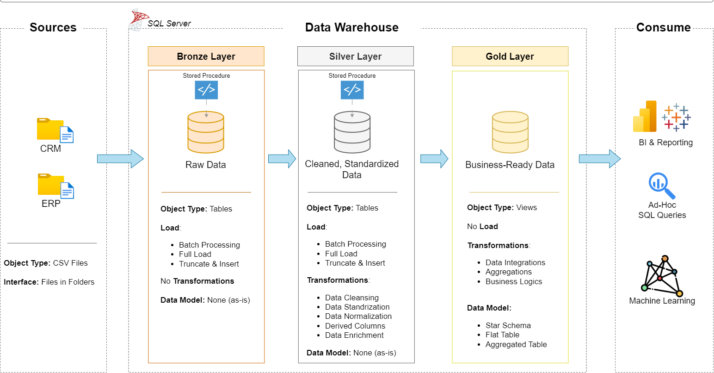

## 📝 Table of Contents

1. [Data Architecture](#data-architecture)
2. [Project Overview](#project-overview)
3. [Repository Structure](#repository-structure)
4. [Inspiration](#inspiration)
5. [Stay Connected](#stay-connected)

<a id="data-architecture"></a>
## 🏗️ Data Architecture

The data architecture for this project follows Medallion Architecture **Bronze**, **Silver**, and **Gold** layers:


1. **Bronze Layer**: Stores raw data as-is from the source systems. Data is ingested from CSV Files into SQL Server Database.
2. **Silver Layer**: This layer includes data cleansing, standardization, and normalization processes to prepare data for analysis.
3. **Gold Layer**: Houses business-ready data modeled into a star schema required for reporting and analytics.

---
<a id="project-overview"></a>
## 📖 Project Overview

This project involves:

1. **Data Architecture**: Designing a Modern Data Warehouse Using Medallion Architecture **Bronze**, **Silver**, and **Gold** layers.
2. **ETL Pipelines**: Extracting, transforming, and loading data from source systems into the warehouse.
3. **Data Modeling**: Developing fact and dimension tables optimized for analytical queries.

---
<a id="repository-structure"></a>
## 📂 Repository Structure

```
data-warehouse-project/
│
├── Architecture/                       # architecture details
│   └──  data_architecture.png      
│
├── datasets/                           # Raw datasets used for the project (ERP and CRM data)
│
├── scripts/                            # SQL scripts for ETL and transformations
│   ├── bronze/                         # Scripts for extracting and loading raw data
│   ├── silver/                         # Scripts for cleaning and transforming data
│   └── gold/                           # Scripts for creating analytical models
│
├── tests/                              # Test scripts and quality files
│
├── .gitignore                          # Files and directories to be ignored by Git
└── Readme.md                           # Project overview and instructions

```

---
<a id="inspiration"></a>
## 📋 Inspiration
This project was inspired by the educational content provided by **Data with Baraa**.
* **Source :** [SQL Data Warehouse from Scratch | Full Hands-On Data Engineering Project (YouTube)](https://www.youtube.com/watch?v=9GVqKuTVANE&t=4984s)

---
<a id="stay-connected"></a>
## ☕ Stay Connected

Let's stay in touch!

[](https://www.linkedin.com/in/oussama-inchallah/)
